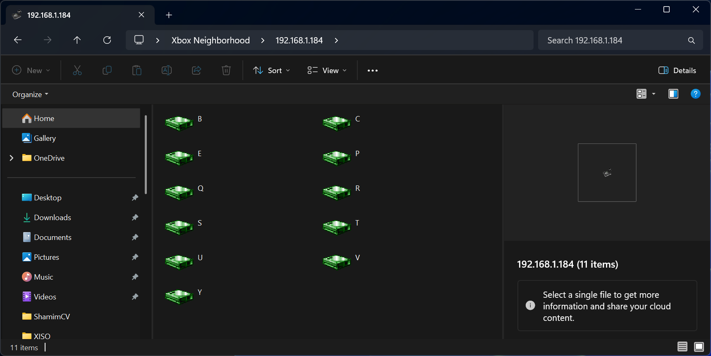
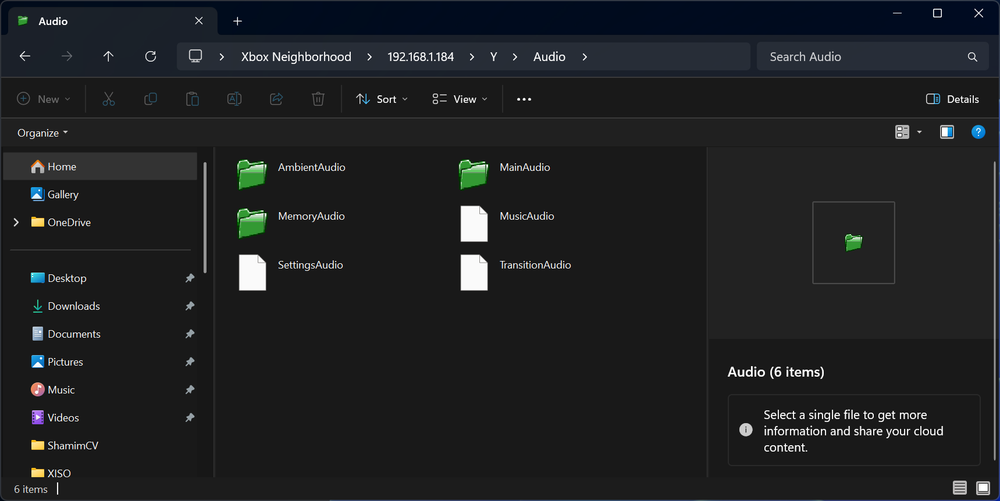

# Xbox Neighborhood

<p align="center">
  <a href="https://discord.gg/VcdSfajQGK"></a>
  &nbsp;
  <a href="https://ko-fi.com/J3J7L5UMN"></a>
  &nbsp;
  <a href="https://www.patreon.com/teamresurgent"></a>
</p>

**Xbox Neighborhood** is the shell extension that shipped with the **Original Xbox XDK**. It adds an Xbox Neighborhood entry to Windows Explorer so you can browse Xbox development kits on your network—the same “Neighborhood” view developers used with the classic Xbox tools.

This repository contains a **recompiled** `xbshlext.dll` and an Inno Setup installer. The original extension was built for older 32-bit Windows versions and no longer works on modern systems. This build targets **64-bit Windows 10 and Windows 11**.

## Screenshots

Click any image for full size.

<p align="center">
  <a href="images/neighborhood-overview.png"></a>
  &nbsp;
  <a href="images/console-context-menu.png"></a>
</p>
<p align="center">
  <a href="images/console-drives.png"></a>
  &nbsp;
  <a href="images/console-audio-folder.png"></a>
</p>

## Install

Download or build `XboxNeighborhood-Setup.exe`, then run it as administrator. The installer registers the shell extension, adds Start menu and desktop shortcuts, and opens Neighborhood in Explorer.

After install, Neighborhood is also available at:

```text
shell:::{DB15FEDD-96B8-4DA9-97E0-7E5CCA05CC44}
```

## Build from source (VS2022)

Requires Visual Studio 2022 with **Desktop development with C++** (v143 toolset).

1. Open **`XboxTools.sln`** in VS2022 and build **Release | x64**:

   - All CLI tools, `xbshlext.dll`, and `xboxdbg-bridge.exe` → `out/bin/x64/Release/`
   - **`imagebld.exe`** still builds as **Win32** (needs `rsa32.lib`) and is staged to `tools/imagebld.exe`

   Use **Release | Win32** only when rebuilding `imagebld` alone.

### Projects (each `.vcxproj` lives alongside its sources under `src/`)

| Project | Output | Links |
|---------|--------|-------|
| `xbdbgs` | `out/lib/.../xbdbgs.lib` | Static debug monitor client |
| `xbshlext` | `out/bin/x64/Release/xbshlext.dll` | `xbdbgs.lib` |
| `xbfile` | `out/lib/.../xbfile.lib` | Shared file helpers (tools only) |
| `xbcp`, `xbdir`, `xbecopy`, `xbmkdir` | `out/bin/x64/Release/*.exe` | `xbdbgs.lib` + `xbfile.lib` |
| `xbox-launch`, `xbWatson` | `out/bin/x64/Release/*.exe` | `xbdbgs.lib` (includes notifications) |
| `imagebld` | `tools/imagebld.exe` (Win32) | RSA signing (`rsa32.lib` in `thirdparty/rsa32/`) |
| `xboxdbg_bridge` | `out/bin/x64/Release/xboxdbg-bridge.exe` | `xbdbgs.lib` + `dbghelp.lib` |

All tools link **`xbdbgs.lib`** statically. **`imagebld`** is the only Win32 target (32-bit RSA library). Everything else is x64, including notification support in `xbdbgs`.

### imagebld

- **`imagebld`** — Xbox Image File Builder (`.xbe` packaging). Also staged to `tools/imagebld.exe`.
- Only **`imagebld`** links `rsa32.lib` (place `thirdparty/rsa32/rsa32.lib`, vendored from RXDK-Libs `prebuilt/tools/`).

## Build the installer

Requires [Inno Setup 6](https://jrsoftware.org/isinfo.php), a built `out/bin/x64/Release/xbshlext.dll`, and these files in the repo root:

- `Icon.ico`
- `WizardImage.bmp`
- `WizardSmallImage.bmp`

From the repo root:

```text
build-installer.cmd
```

The setup executable is written to `output\XboxNeighborhood-Setup.exe`.

## Requirements

- **64-bit** Windows 10 or Windows 11
- Administrator rights (the shell extension is registered machine-wide)

## Uninstall

Use **Apps & features** (or **Installed apps**) and remove **Xbox Neighborhood**, or run the uninstaller from the Start menu entry.
